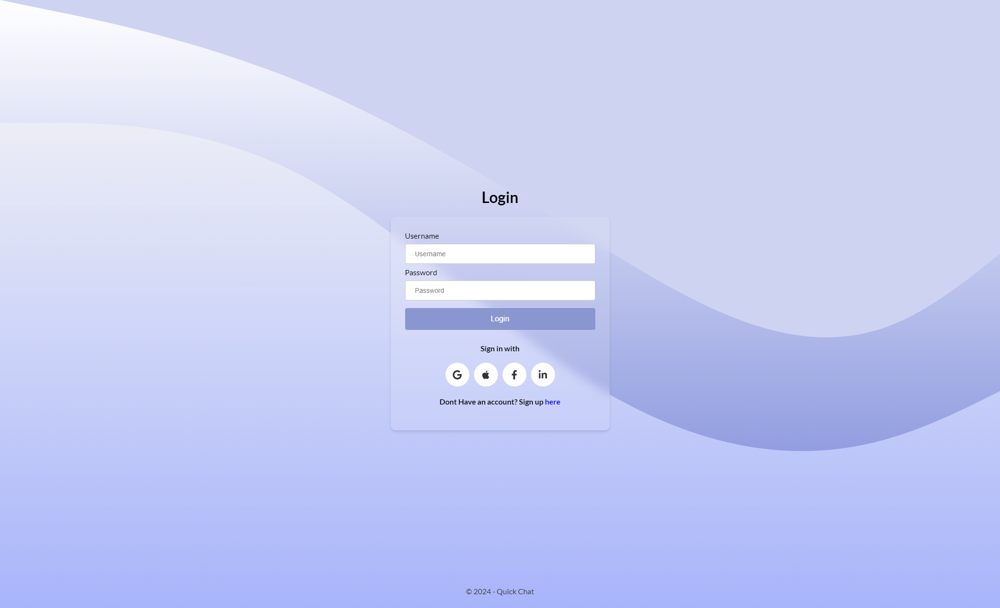
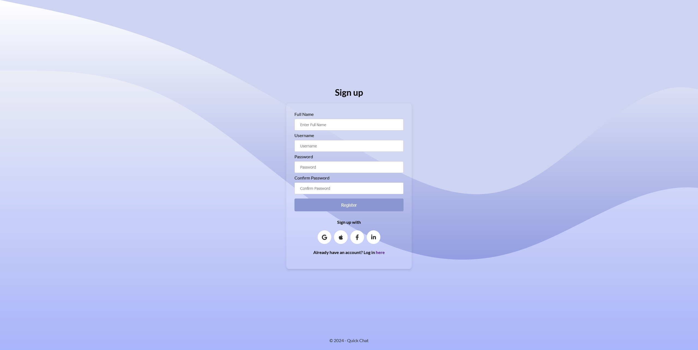
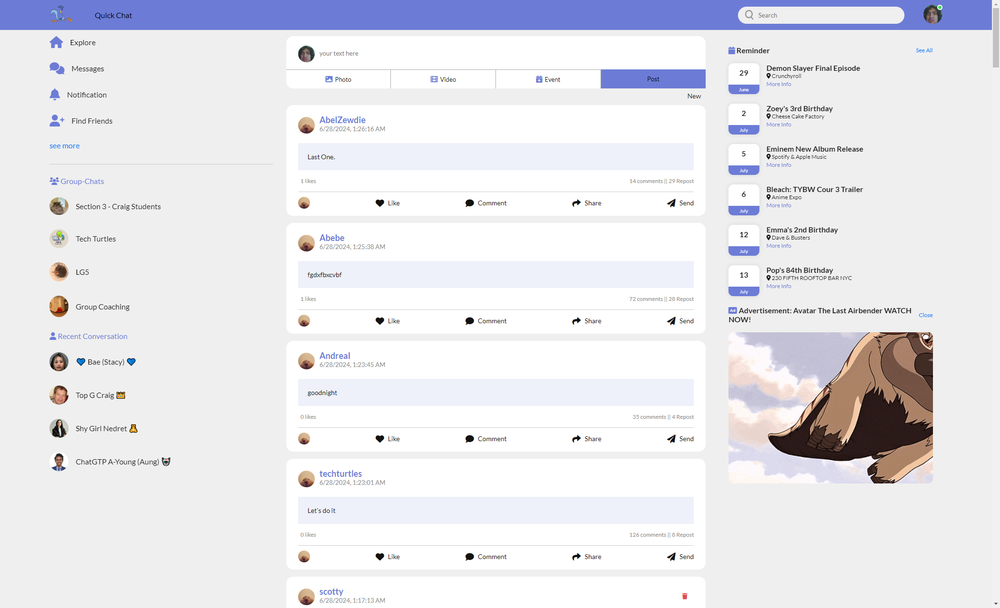
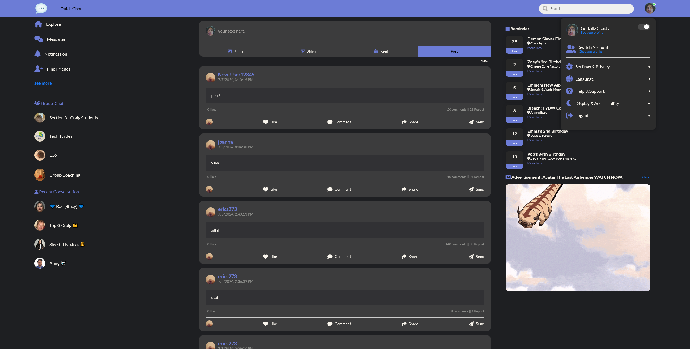
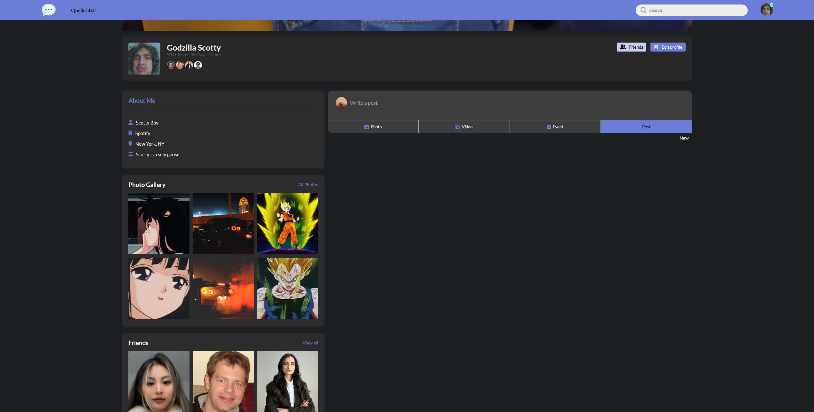
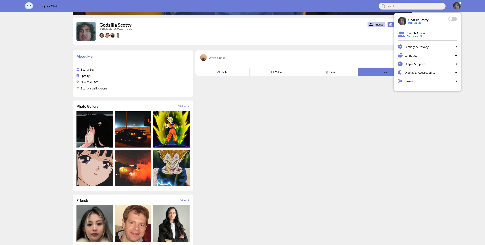

# Welcome to Quick Chat 💬
This project uses the MicroblogLite API so users can create posts to share insights about their craft, hobby, or profession. 

[Click Here to visit](https://quickchatblog.netlify.app/) 

# Technologies Used 💻
- HTML
- CSS
- JavaScript
- Postman
- Font Awesome CDN

# Credit 📜

Read the [_MicroblogLite_ API docs](http://microbloglite.us-east-2.elasticbeanstalk.com/) 