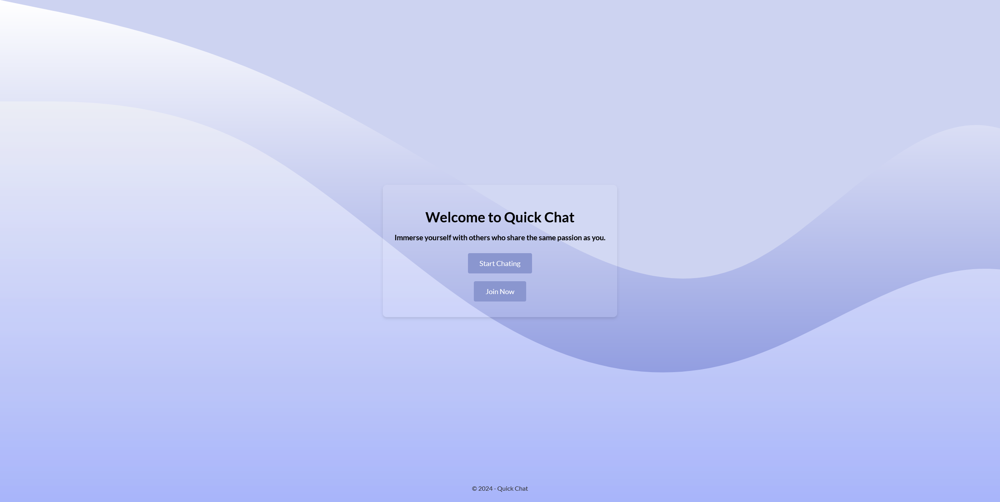
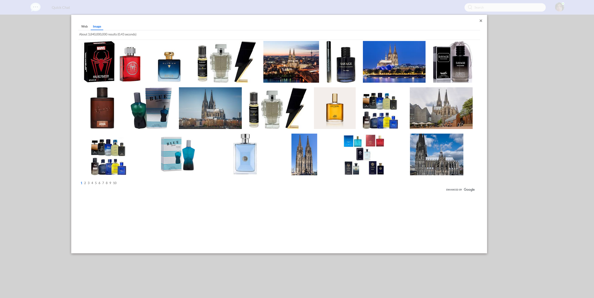

# Welcome to Quick Chat 💬

This project uses the MicroblogLite API so users can create posts to share insights about their craft, hobby, or profession.

[Click Here to visit](https://quickchatblog.netlify.app/)

### Landing

### Login

### Signup

### Dashboard (light Mode)

### Dashboard (Dark Mode)

### Profile Page (Dark Mode)

### Profile Page (light Mode)

### Google Search (Dark Mode)

### Google Search (light Mode)

# Technologies Used 💻

- HTML
- CSS
- JavaScript
- Postman / REST Client (VSCode extension)
- Font Awesome CDN

# Credit 📜

Read the [_MicroblogLite_ API docs](http://microbloglite.us-east-2.elasticbeanstalk.com/)